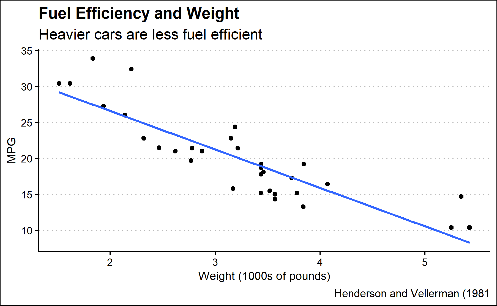

```{r setup, include=FALSE}
knitr::opts_chunk$set(echo = FALSE)
library(tidyverse)
library(ggthemes)
library(knitr)

```

```{r car-plot}
#Miles per gallon and car weight selected to study relationship between heavier cars and their fuel efficiency
#geom_smooth function added to show line of best fit in the graph.
car_plot <- read_rds("car_plot.rds")
car_plot

ggsave("car-plot.png", plot = car_plot)

```

```{r}

```

